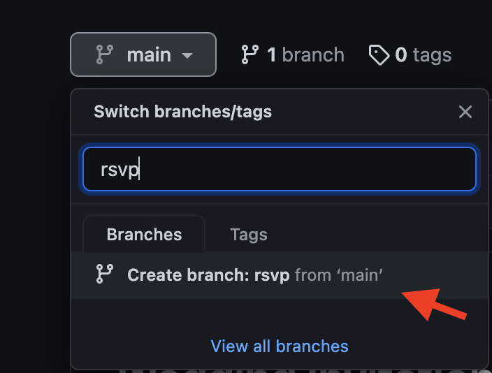

# Elizabeth & Philip
Elizabeth and Philip are inviting everyone to their wedding! They would like all the guests to RSVP to their wedding by adding their name to the list of the guests in this repository.

Let Elizabeth and Philip know if you can make it to their wedding by following the instructions. 

# How to RSVP? 
There are several possible methods to make a change in a public Github repository. Below we discuss two ways; 1) Through the Github web interface, and 2) By git comman line. 

## Github Web Interface 

### Assumptions
- You have a Github user account
- You have basic familiarity with Markdown

1. Start by forking the repository to your Github user account. A fork is a copy of a repository. Forking a repository allows you to make changes to a copy of the repository stored in your own Github account without impacting the public repository. 
Fork the repository by clicking on the fork button at the top right corner. 

When you fork the repository, the counter number next to the Fork button on the public repository will be incremented. This indicates how many users have forked this repository. That is the only change you see on the public repository side. Feel free to experiment with the forked copy of the repository in your own Github account. 

2. In the forked copy of the repository in your Github account, click on the drop down menu that shows `main`. This is the current branch of the repository displayed. The dropdown manu shows other available branches in the repository and also enables you to create a new branch. 
Create a new branch named `rsvp`.

3. On the `rsvp` branch, open the `guests.md` file and then click on the little pencil button that says `Edit this file`. 

4. The `guests.md` file is a Markdown table that includes the list of all the guests who have RSVPed to the wedding. Add a new row to the table and include your name and information. 

